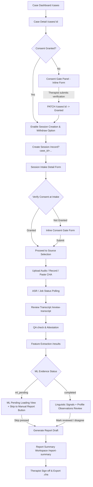

# Spec: LinguaLens Therapist Workflow Integration

Status: Historical
Not a source of truth
Superseded by: `docs/PROJECT_SOURCE_OF_TRUTH.md`

**Date:** 2026-07-03
**Status:** Approved (Brainstormed Approach A)
**Author:** Antigravity AI Coding Assistant

---

## 1. Overview & Context

This document details the design specifications for integrating and refining the therapist-facing workflow in the LinguaLens Next.js web application (`apps/lingualens-app/`). The objective is to build a cohesive, role-aware clinical workspace that functions gracefully even while downstream backend features (like ASR pipelines or finished ML algorithms) are in a mock/pilot state.

Specifically, we are implementing:
1. **Consent & Intake Gate**: Restricting session creation and recording/uploading for any case where parental/caregiver consent is not explicitly granted. Providing direct inline tools to record and withdraw consent.
2. **Session Pipeline Progress Tracker**: A visual horizontal progress tracker showing the full life cycle of a session from consent to report sign-off.
3. **ML-Pending & Interactive Observation Review**: A dynamic loading states screen with safety disclaimers during ML analysis, equipped with a "Skip to Manual Report" escape hatch.

---

## 2. Technical Design & User Flow



### Component Spacing & Layout Constraints
All new designs will strictly conform to the **Astryx CLI guidelines** (`apps/lingualens-app/.claude/CLAUDE.md`):
- **No raw `div` tags`** for layouts: Use `@astryxdesign/core` layout wrappers such as `Stack`, `Grid`, `LayoutPanel`, `AppShell`, etc.
- **Tokenized styling**: Reference design system tokens (e.g. `bg-surface`, `text-primary`, `rounded-lg`) instead of raw hex values or custom pixels.

---

## 3. Detailed Component Modifications

### 3.1. API & Service Layer (`src/lib/workflow.ts`)
We will add new client wrapper functions calling the existing FastAPI backend routes for cases:
- `createBackendCase(payload: Partial<BackendCase>): Promise<BackendCase>`
- `updateBackendCase(caseId: string, payload: Partial<BackendCase>): Promise<BackendCase>` (sends `PATCH /cases/{caseId}`)
- `withdrawBackendCaseConsent(caseId: string, reason: string, redactNotes: boolean): Promise<any>` (sends `POST /cases/{caseId}/withdraw-consent`)

### 3.2. Consent & Intake Gate UI (`src/components/cases-workspace-client.tsx`)
- Inside `CaseDetailContent`, we will introduce a new card component `ConsentGateCard`:
  - It reads `caseItem.consent_status`.
  - If status is `pending` or `withdrawn`, display a **Caution Alert Banner**: *"Case requires caregiver consent validation before starting clinical workflows."*
  - Provide an inline form with:
    - Checkbox: *"I verify that written or verbal caregiver consent has been obtained."*
    - Date field: `consent_date` (defaults to today).
    - Text field: `signer_relationship` (e.g., Parent, Guardian).
    - Textarea: `notes`.
    - Button: *"Verify and Grant Consent"*. Fired actions call `updateBackendCase` and update case state.
  - Disable the **"Create new session"** button in `PageHeader` when consent is not `granted`, displaying a tool-tip or helper text.
  - If consent is `granted`, display:
    - Summary status with a green badge: *"Consent granted by [relationship] on [date]"*.
    - A secondary button: *"Withdraw Consent"*. When clicked, this prompts a verification dialog and fires `withdrawBackendCaseConsent` to set state to `withdrawn`.

### 3.3. Intake Gate in Session Wizard (`src/components/session-workspace-client.tsx`)
- In `SessionWorkspaceClient`'s Step 1 (`details` intake step):
  - Load the case context via `caseId`.
  - If `childCase.consent_status !== "granted"`, replace the normal intake details form with a blocking **"Consent Verification Gate"** card.
  - Show the same inline Consent Form (Confirm Checkbox, Signer Relationship, Notes) to record consent immediately. Clicking *"Verify & Grant"* submits to the backend and advances the therapist back to the intake details form.

### 3.4. Pipeline Progress Bar (`src/components/pipeline-progress-bar.tsx` or inline)
- Create a new horizontal visual tracker `PipelineProgressBar` mapping to these states:
  - `Awaiting Consent` (locked state)
  - `Ready for Audio` (intake details completed)
  - `Uploading/Processing` (recording or audio file job processing)
  - `Transcribing` (ASR job running)
  - `Review Required` (ASR draft complete, awaiting review/attestation)
  - `ML Pending` (attested, features extracted, waiting for clinical suggestions)
  - `Report Ready` (report draft generated, ready for final supervisor sign-off)
- Integrate this component at the top of `SessionWorkspaceClient`'s views (`record`, `transcript`, and `results`).

### 3.5. ML-Pending & Observations Escape Hatch (`src/components/session-workspace-client.tsx`)
- In `SessionResultsView`, if the state transitions to results but `mlDecisionSupport` is not yet available, check the session status:
  - If `state.analysisStatus === "processing"` or `mlDecisionSupport` is missing, render a **Dynamic Loading Panel**:
    - Animated loader bar.
    - Safety disclaimer: *"Linguistic observation analysis in progress. These suggestions support therapist decision-making and are not automated diagnoses."*
    - Button: **"Skip to Manual Report"**. Clicking this cancels the waiting spinner, calls `onGenerateReport()` directly (generating a template-based report), and routes the user directly to the `/report-summary` workspace.

---

## 4. Verification Plan

### 4.1. Automated Unit Tests
We will add new tests inside:
- `src/__tests__/cases-workspace-client.test.tsx`:
  - Verify that cases with pending or withdrawn consent disable the session creation action.
  - Verify that submitting the consent form updates the case in the backend and unlocks session creation.
  - Verify that withdrawing consent marks the case as withdrawn.
- `src/__tests__/session-intake-flow.test.tsx`:
  - Verify that Session Intake shows a blocking consent gate if case consent is missing.
  - Verify that inline consent submission unlocks intake details.
- `src/__tests__/pages.test.tsx` (workflow test):
  - Verify the "Skip to Manual Report" button bypasses ML observations processing and successfully generates a draft report.

### 4.2. Build & Typechecks
Run these commands to ensure codebase integrity:
```bash
cd apps/lingualens-app
npm run typecheck
npm run build
npm test
```
