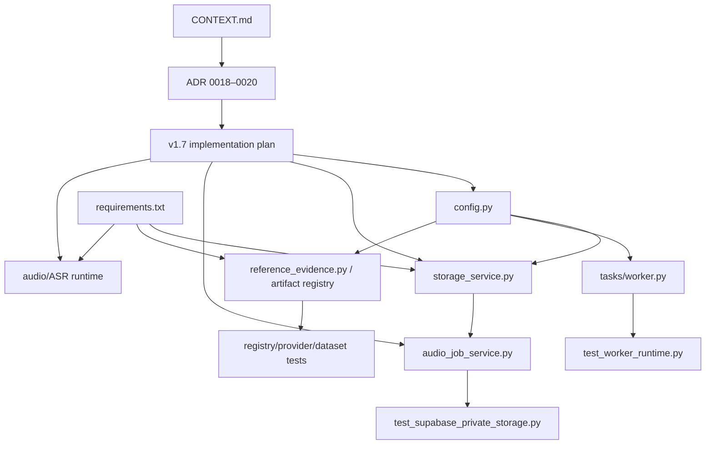

# LinguaLens v1.7.0 WIP Baseline Audit

Audit date: 2026-07-25

Repository: `/Users/porschecaa/lingualens`

Original branch: `codex/lingualens-ux-modernization`

Original HEAD: `8efaceca4cbe9c5cd8fa63b7d01c5eab3e106d55`

Audited implementation baseline: `d13ca939be1497a53eb0431ca457aa91507f2760`

The audited implementation baseline contains only the reviewed v1.7.0
architecture decisions, glossary updates, and implementation plan. Runtime WIP
that was incomplete or unsafe was preserved but not committed. This audit
record is necessarily committed after the baseline it identifies; it does not
change runtime behavior.

## Preservation record

The complete Git-visible working state was captured before audit in:

`/Users/porschecaa/.codex/backups/lingualens/20260725T043346Z-wip-baseline/`

The directory and every backup file are owner-only (`0700`/`0600`).

| Backup object | SHA-256 |
|---|---|
| `tracked-working-tree.patch` | `7136b522e6d69a345d5fc88e1f4f55104d5627f5d79748ad221f3a0c47486049` |
| `index.patch` | `e3b0c44298fc1c149afbf4c8996fb92427ae41e4649b934ca495991b7852b855` |
| `status-short.txt` | `029fc459e3ffe1d84c04357dd7e7917ea84aa339aedd1d5ed4214e7255d874cd` |
| `tracked-inventory.txt` | `33c6c06dac8a3a73630acbb98b74d0e690f3ebf4acffa597e7291e5a98fe462b` |
| `untracked-inventory.txt` | `67a7aab0dd2443cb3a2e837047dfa8db990dd417633267c77d6f4899fc1fdefc` |
| `untracked-files.tar.gz` | `6f27495383e90c39e5b590ee29ea5fbe7f7d658d17f082e77a728e5b8860f03e` |
| `ignored-staging-verification.env` | `fb3ef9306ffb8a7734cbcc311ed19ca1241e50fd20f53887d7ebbdfb2b2a9a3b` |

`tracked-working-tree.patch` was produced with `git diff --binary HEAD`.
The untracked archive contains all 138 paths returned by
`git ls-files --others --exclude-standard` at capture time. The ignored staging
environment file was copied separately because it cannot be represented in a
Git patch.

The ignored staging file contains JWTs and test-account identifiers. It must
never be committed. The audit did not print its contents, and its backup is
permission-restricted. Dependency trees, caches, `.local` storage, generated
build output, and installed agent skills were not treated as Git WIP.

## Audit outcome

The important result is not that the focused unit tests are green. Several
tests validate a scaffold while the underlying production-shaped integrity
contract remains unsafe:

- Supabase completion may succeed when remote size metadata is absent, trusts a
  caller-provided checksum, reports a TTL the SDK does not enforce, and selects
  the current configured adapter rather than the storage mode recorded with the
  audio asset.
- The Redis worker removes a job with `LPOP` before processing and has no
  reservation, acknowledgment, lease, retry, or crash recovery.
- The proposed active reference artifact has
  `promotion_gate.passed=false`, while registry and status text claim it passed.
- Missing reference metadata is silently imputed as English/toy-play, changing
  cohort eligibility without source evidence.
- The verification runner can recursively delete `.local`, including the
  repository's documented local private-storage location.
- The release builder packages the live filesystem but labels it with `HEAD`,
  so uncommitted or sensitive material can be attributed to the wrong commit.

Accordingly, storage, audio-job completion, worker, ML activation, release
tooling, and generated release evidence were not included in the baseline.

## Dependency relationships

More specifically:

- `config.py` currently mixes Supabase storage settings, worker settings, and
  reference-artifact defaults. These hunks must not be committed as one unit.
- `storage_service.py` consumes Supabase URL, service-role key, bucket, and TTL
  settings. `audio_job_service.py` calls its verification hook before changing
  an upload from pending to uploaded.
- `test_supabase_private_storage.py` uses a fake bucket and proves local control
  flow only. It does not establish checksum integrity, expiry enforcement, or
  real SDK/bucket compatibility.
- `worker.py` consumes poll and batch settings. Its unit tests use the memory
  queue, not the destructive Redis path.
- `requirements.txt` mixes scientific/audio pins with unrelated SQL packages,
  keeps `faster-whisper` and `soundfile` floating, and does not establish the
  pinned ASR runtime required by v1.7.0.
- ADR 0018–0020 and `CONTEXT.md` define the accepted CHAT, feature, and QA
  contracts. They are planning authority, not evidence that those capabilities
  already exist.

## Classification of tracked changes at capture

| Path | Classification | Disposition |
|---|---|---|
| `.github/workflows/deploy.yml` | intentional but incomplete | Hold with Python runtime matrix evidence. |
| `CHANGELOG.md` | documentation/decision record | Hold; mixes unrelated work and premature claims. |
| `CONTEXT.md` | documentation/decision record | Committed with ADR 0018–0020. |
| `PROJECT_STATUS.md` | documentation/decision record | Hold; current gate and capability claims are inaccurate. |
| `README.md` | documentation/decision record | Hold; malformed and conflicting remediation text. |
| `SCOPE_AND_DELIVERABLES.md` | unrelated change | Keep outside v1.7 baseline. |
| `apps/api/README.md` | documentation/decision record | Hold until storage/worker behavior matches it. |
| `apps/api/app/core/config.py` | intentional but incomplete | Hold and split by storage, worker, and ML responsibilities. |
| `apps/api/app/services/audio_job_service.py` | unsafe or not understood | Hold; upload completion is not server-authoritative. |
| `apps/api/app/services/ml_providers/reference_evidence.py` | unsafe or not understood | Hold; registry bypass and import-time failure paths. |
| `apps/api/app/services/storage_service.py` | unsafe or not understood | Hold; unenforced TTL and fail-open integrity checks. |
| `apps/api/app/tasks/worker.py` | unsafe or not understood | Hold; Redis crash-loss behavior. |
| `apps/api/tests/test_one_day_pilot.py` | unrelated change | Keep with report eligibility/sign-off work. |
| `apps/api/tests/test_reference_evidence_provider.py` | intentional but incomplete | Hold with corrected artifact governance. |
| `apps/api/tests/test_workflow.py` | intentional but incomplete | Hold; asserts availability of a failed-gate artifact. |
| `artifacts/reference_evidence/candidate-v1/canonical_rows.csv` | generated evidence | Delete only atomically with reviewed replacement. |
| `artifacts/reference_evidence/candidate-v1/dataset_audit.csv` | generated evidence | Same. |
| `artifacts/reference_evidence/candidate-v1/gate1_validation.json` | generated evidence | Same. |
| `artifacts/reference_evidence/candidate-v1/manifest.json` | generated evidence | Same. |
| `artifacts/reference_evidence/candidate-v1/reference_cells.csv` | generated evidence | Same. |
| `docs/DEPLOYMENT.md` | documentation/decision record | Hold; mixed frontend/storage/artifact claims. |
| `docs/PRODUCTION_SAAS_FIRST_LAUNCH_BACKLOG.md` | documentation/decision record | Hold; overstates storage and worker evidence. |
| `docs/PROJECT_SOURCE_OF_TRUTH.md` | documentation/decision record | Hold until registry-only selection is enforced. |
| `docs/RENDER_BACKEND_STAGING_RUNBOOK.md` | documentation/decision record | Hold; wrong Supabase URL form and non-durable queue claims. |
| `packages/ml/reference_dataset.py` | unsafe or not understood | Hold; unsupported language/task imputation. |
| `requirements.txt` | intentional but incomplete | Hold; mixed dependency purposes and floating ASR stack. |
| `scripts/check_project.sh` | intentional but incomplete | Hold; validated and executed interpreters can differ. |
| `scripts/check_repo_consistency.py` | intentional but incomplete | Hold with release-scope package. |
| `scripts/package_release.sh` | intentional but incomplete | Hold; depends on uncommitted archive builder. |
| `scripts/security_scan.py` | intentional and complete | Safe but unrelated; not included in v1.7 baseline. |
| `tests/test_ml_reference_dataset.py` | unsafe or not understood | Hold; codifies unsupported metadata defaults. |

## Classification of non-release untracked files at capture

| Path | Classification | Disposition |
|---|---|---|
| `.python-version` | intentional and complete | Candidate Python-runtime commit, not v1.7 baseline. |
| `apps/api/app/services/ml_artifact_registry.py` | intentional but incomplete | Hold for failed-gate and manifest-parity enforcement. |
| `apps/api/tests/test_ml_artifact_registry.py` | intentional but incomplete | Hold; missing failed-gate cases. |
| `apps/api/tests/test_supabase_private_storage.py` | intentional but incomplete | Hold with storage repair and real integration proof. |
| `apps/api/tests/test_worker_runtime.py` | intentional but incomplete | Hold; memory-queue coverage only. |
| `artifacts/active_artifacts.json` | unsafe or not understood | Do not activate failed-gate artifact. |
| `artifacts/artifact_registry.json` | unsafe or not understood | Contains false promotion claim. |
| `artifacts/reference_evidence/reference-core-14-v1/canonical_rows.csv` | generated evidence | Separate privacy/redistribution review. |
| `artifacts/reference_evidence/reference-core-14-v1/dataset_audit.csv` | generated evidence | Same artifact bundle. |
| `artifacts/reference_evidence/reference-core-14-v1/gate1_validation.json` | generated evidence | Preserve as truthful failed-gate evidence only. |
| `artifacts/reference_evidence/reference-core-14-v1/manifest.json` | generated evidence | Research-only artifact evidence. |
| `artifacts/reference_evidence/reference-core-14-v1/reference_cells.csv` | generated evidence | Separate privacy/sparse-cell review. |
| `artifacts/verification/verification_summary.json` | generated evidence | Regenerate from a clean committed tree. |
| `data/manifests/research_datasets.json` | documentation/decision record | Hold for data-governance review. |
| `docs/RENDER_FRONTEND_STAGING_RUNBOOK.md` | intentional but incomplete | Revise workstation links and hard-coded project ref. |
| `docs/THERAPIST_PRESENTATION_BLUEPRINT.md` | unsafe or not understood | Exclude; contains unsupported diagnostic-adjacent claims. |
| `docs/adr/0018-use-canonical-semantic-chat-round-trip.md` | documentation/decision record | Committed in audited baseline. |
| `docs/adr/0019-use-thai-aware-deterministic-descriptive-features.md` | documentation/decision record | Committed in audited baseline. |
| `docs/adr/0020-separate-integrity-blockers-from-acknowledgeable-limitations.md` | documentation/decision record | Committed in audited baseline. |
| `docs/remediation/LINGUALENS_REMEDIATION_REPORT.md` | unsafe or not understood | Historical report overclaims current ML readiness. |
| `docs/superpowers/plans/2026-07-25-lingualens-v1-7-0-core-speech-to-chat.md` | documentation/decision record | Relocated and committed as `docs/core-speech-testbed/IMPLEMENTATION_PLAN.md`. |
| `pyproject.toml` | intentional and complete | Candidate Python-runtime commit. |
| `scripts/benchmark_clinical_speech_artifacts.py` | intentional and complete | Candidate research-audio tooling commit. |
| `scripts/build_review_archive.py` | intentional but incomplete | Hold; dirty-tree provenance and sensitive-data exposure. |
| `scripts/build_review_archive.sh` | intentional but incomplete | Hold with builder. |
| `scripts/check_diarization_runtime.py` | intentional but incomplete | Hold; dependency presence is not model readiness. |
| `scripts/check_python_runtime.py` | intentional and complete | Candidate Python-runtime commit. |
| `scripts/promote_artifact.py` | intentional but incomplete | Hold; does not reject failed promotion gates. |
| `scripts/release_scope.py` | intentional but incomplete | Hold; approved roots are too broad. |
| `scripts/run_verification.py` | unsafe or not understood | Do not run/commit; deletes `.local`. |
| `scripts/runtime_support.py` | intentional and complete | Candidate Python-runtime commit. |
| `scripts/verify_all.sh` | unsafe or not understood | Hold; invokes destructive verification runner. |
| `scripts/verify_backend.sh` | intentional and complete | Candidate verification-entrypoint commit. |
| `scripts/verify_frontend.sh` | intentional and complete | Candidate verification-entrypoint commit. |
| `scripts/verify_legacy.sh` | intentional and complete | Candidate verification-entrypoint commit. |
| `scripts/verify_migrations.sh` | intentional and complete | Candidate verification-entrypoint commit. |
| `scripts/verify_ml_artifacts.py` | intentional but incomplete | Hold; validates hashes, not promotion outcome. |
| `scripts/verify_ml_artifacts.sh` | intentional but incomplete | Hold with ML verifier. |
| `scripts/verify_release_archive.sh` | intentional but incomplete | Hold with archive verifier. |
| `scripts/verify_repo_hygiene.sh` | intentional but incomplete | Hold with release scope. |
| `scripts/verify_research_audio.sh` | intentional and complete | Candidate research-audio tooling commit. |
| `scripts/verify_review_archive.py` | intentional but incomplete | Hold; incomplete internal metadata/provenance checks. |
| `scripts/verify_shared.sh` | intentional and complete | Candidate verification-entrypoint commit. |
| `tests/test_check_diarization_runtime_script.py` | intentional but incomplete | Hold; missing auth/readiness and no-secret cases. |
| `tests/test_clinical_speech_benchmark.py` | intentional and complete | Candidate research-audio tooling commit. |
| `tests/test_clinical_speech_quality.py` | intentional and complete | Candidate research-audio tooling commit. |
| `tests/test_create_supabase_project_setup_evidence_script.py` | unrelated change | Separate from v1.7 work. |
| `tests/test_promote_artifact.py` | intentional but incomplete | Hold; missing failed-gate coverage. |
| `tests/test_python_runtime_support.py` | intentional and complete | Candidate Python-runtime commit. |
| `tests/test_release_scope.py` | intentional but incomplete | Hold; missing dirty-tree and protected-data cases. |
| `tests/test_review_archive.py` | intentional but incomplete | Hold; incomplete metadata/provenance checks. |

## Classification of 87 untracked release-evidence files

Every file below `docs/release_artifacts/**` in the original untracked inventory
was reviewed. The path rules below are exhaustive for those 87 files.

| Exact path or exhaustive path set | Classification | Disposition |
|---|---|---|
| `docs/release_artifacts/auth_verifier/preflight/2026-07-08_001154_settings.headers.txt` | intentional but incomplete | Empty capture; exclude. |
| All 27 files under `docs/release_artifacts/auth_verifier/preflight/**` other than the empty file above | generated evidence | Only the three `2026-07-08_002101_settings.*` files belong to the candidate partial-auth bundle; all retry captures are excluded. |
| All 3 files under `docs/release_artifacts/auth_verifier/probes/2026-07-08_001220/**` | generated evidence | Failed/superseded retry; exclude. |
| All 10 files under `docs/release_artifacts/auth_verifier/probes/2026-07-08_002101/**` | generated evidence | Candidate partial-auth evidence after synthetic-identity review. |
| All 21 files under `docs/release_artifacts/auth_verifier/probes/2026-07-08_012328/**`, `053724/**`, `054614/**`, `055748/**`, `055807/**`, `061403/**`, and `061421/**` | generated evidence | Failed/superseded retries; exclude. |
| `docs/release_artifacts/auth_verifier/verifier-run-summary.md` | generated evidence | Candidate partial-auth summary; must be labeled partial. |
| All 24 files under `docs/release_artifacts/tenant_safety/probes/2026-07-08_002104/**` | generated evidence | Incomplete tenant gate; exclude pending clean rerun and summary. |

The candidate partial-auth bundle exposes request/correlation IDs and synthetic
case/user/org identifiers. It contains no password, bearer token, cookie,
service-role key, or private key, but must not be committed until those
identities are confirmed as synthetic and unnecessary identifiers are redacted.

## Tests and inspections executed

| Scope | Command | Result |
|---|---|---|
| Backup integrity | `gzip -t .../untracked-files.tar.gz` and archive/inventory count comparison | Pass; 138 archived paths matched 138 inventory paths. |
| Storage scaffold | `PYTHONPATH=apps/api .venv312/bin/python -m pytest apps/api/tests/test_supabase_private_storage.py -q` | 6 passed. |
| Worker scaffold | `PYTHONPATH=apps/api .venv312/bin/python -m pytest apps/api/tests/test_worker_runtime.py -q` | 3 passed. |
| Runtime/audio scripts | `.venv312/bin/python -m pytest tests/test_python_runtime_support.py tests/test_check_diarization_runtime_script.py tests/test_clinical_speech_quality.py tests/test_clinical_speech_benchmark.py -q` | 8 passed. |
| ML registry/provider/dataset | `PYTHONPATH=apps/api .venv312/bin/python -m pytest apps/api/tests/test_ml_artifact_registry.py apps/api/tests/test_reference_evidence_provider.py tests/test_ml_reference_dataset.py tests/test_promote_artifact.py -q` | 70 passed, but tests do not assert promotion-gate truth. |
| Release/archive before plan relocation | `.venv312/bin/python -m pytest tests/test_release_scope.py tests/test_review_archive.py tests/test_promote_artifact.py -q` | 8 passed, 3 failed because `docs/superpowers/**` is forbidden. |
| Release/archive after plan relocation | Same command | 11 passed. |
| Repository consistency after plan relocation | `.venv312/bin/python scripts/check_repo_consistency.py` | Pass. |
| Patch whitespace | `git diff --check` and staged equivalent | Pass. |

The first storage invocation omitted `PYTHONPATH=apps/api` and failed during
collection with `ModuleNotFoundError: app`; it was rerun with the documented
environment and passed. No result above is interpreted as production,
staging, clinical, or end-to-end evidence.

## Commit grouping and disposition

| Proposed group | Actual disposition |
|---|---|
| `feat(storage): establish verified private audio storage foundation` | Not created. The implementation is unsafe/incomplete and “verified” would be false. |
| `feat(audio): establish upload-first audio job contract` | Not created. Completion still trusts client claims and does not derive decoded duration/checksum server-side. |
| `test(audio): cover storage and audio-job baseline behavior` | Not created separately. Tests prove scaffold control flow but would legitimize unsafe behavior without missing integrity cases. |
| `chore(runtime): pin required audio and ASR dependencies` | Not created. ASR dependencies remain floating and the diff mixes SQL/runtime work. |
| `docs(adr): record v1.7.0 speech-to-CHAT decisions` | Created as `d13ca939be1497a53eb0431ca457aa91507f2760`. |

Additional WIP groups—ML artifact activation, worker runtime, release/archive
tooling, generated verification evidence, staging docs, status docs, and
presentation material—remain explicitly outside the v1.7 baseline.

## Unresolved limitations and required remediation

1. Bind upload verification to the audio record's storage mode and require
   server-observed size, checksum/provenance, and decoded duration before job
   creation.
2. Do not claim or return a signed-upload TTL unless the concrete provider
   enforces it.
3. Add a real private-bucket integration probe before enabling the capability.
4. Replace Redis `LPOP` processing with reservation/acknowledgment/retry and
   crash recovery, or label it best-effort and non-durable.
5. Reject ML promotion when the evaluation gate is false; remove unsupported
   metadata imputation and reconcile registry/manifest semantics.
6. Remove destructive `.local` deletion from verification and bind archive
   provenance to an exact reviewed payload, not merely `HEAD`.
7. Keep generated release evidence, unsafe presentation claims, and historical
   remediation claims out of current v1.7 status.
8. Keep the ignored staging credential file out of Git and rotate/revoke the
   represented test sessions if they are still valid.

## Baseline rule for Task 1

Task 1 must start from
`d13ca939be1497a53eb0431ca457aa91507f2760`, plus this audit record only.
Held WIP may be consulted as evidence but must not be copied wholesale. Each
later task must port or rewrite only the reviewed parts, add the missing
integrity tests first, and commit a coherent safe group.
