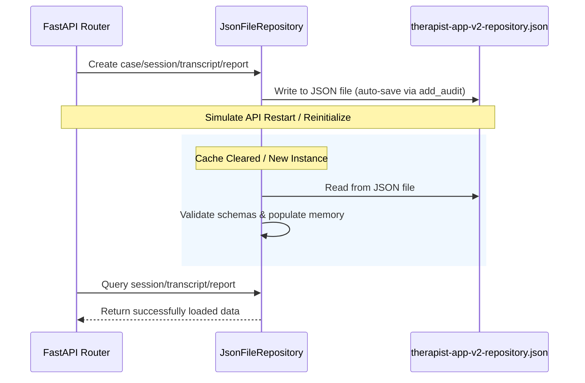

# Design Specification: Persistence Verification Hardening

This document defines the design and validation plan for hardening persistence verification across the Therapist App v2 backend repository and frontend workflow components.

---

## 1. API Restart Persistence (Backend)

### Goal
Ensure that the JSON repository (`JsonFileRepository`) correctly saves, persists, and restores all core entities (case, session, transcript, and report) across restarts.

### Architecture & Data Flow


### Components
* `JsonFileRepository`: Inherits from `MockRepository` and manages serializing/deserializing the clinical data entities to/from a local JSON file.
* Test suite (`apps/api/tests/test_workflow.py`):
  * Unit test: `test_json_repository_direct_restart_persistence`
    * Directly instantiates `JsonFileRepository` at a temporary path.
    * Adds entities (`ChildCase`, `TherapySession`, `Transcript`, `Report`).
    * Instantiates a new `JsonFileRepository` referencing the same path.
    * Verifies that the restored repository matches all field values.

---

## 2. Frontend Backend-Source-of-Truth

### Goal
Prevent stale `sessionStorage` workflow data from overwriting or being temporarily displayed when a specific `transcript_id` (or other locator) is requested in the URL.

### Data Flow
```
User Navigates with URL: /review-transcript?transcript_id=TRANSCRIPT-123
   |
   +---> [session-workspace-client.tsx] mounts
   |
   +---> [loadWorkflowState] reads sessionStorage
   |
   +---> Is there a locator in URL? YES
   |        |
   |        +---> Initial state sets workflowLoading = true
   |        |     AND clears transcriptText/transcriptLines/qaIssues
   |        |     (Prevents stale sessionStorage leak)
   |
   +---> Async useEffect fetches TRANSCRIPT-123 from API
   |        |
   |        +---> Fetch Success:
   |        |     Update state with backend transcript (wins)
   |        |     Save updated state to sessionStorage
   |        |
   |        +---> Fetch Failure:
   |              Set backendUnavailable = true
   |              Clear transcriptText/lines to avoid stale render
```

### Components
* `SessionWorkspaceClient` (`apps/therapist-app-v2/src/components/session-workspace-client.tsx`):
  * Clear `transcriptText`, `transcriptLines`, `qaStatus`, `qaIssues`, etc. in the initial loading state.
  * Explicitly map fetched backend transcript parameters to the state.
* `ReportSummaryClient` (`apps/therapist-app-v2/src/components/report-summary-client.tsx`):
  * Clear `reportMarkdown` and report inputs if the URL contains a locator and is loading, so that a stale sessionStorage report is not shown.

---

## 3. Offline Local Mode

### Goal
Provide clear visual cues and disable final actions when the backend is unreachable.

### Components & UI States
* **Banner**: Keep showing `"Backend unavailable — local workspace mode"` if offline.
* **Success Messages**:
  * Modify `WorkflowStatus` component in `session-workspace-client.tsx` and `report-summary-client.tsx` to accept a `backendUnavailable` prop.
  * If `backendUnavailable` is true, return `null` for success status messages, showing only error messages.
* **Attest Transcript Action** (`TranscriptEditorPanel`):
  * Disable the `Attest transcript` button if `backendUnavailable` is true.
  * Set button text to `"Attest transcript (Online only)"`.
* **Finalize Report Action** (`ReportSummaryClient`):
  * Disable the `Finalize Report` button if `backendUnavailable` is true.
  * Set button text to `"Finalize Report (Online only)"`.

---

## 4. Report Finalization

### Goal
Ensure that a report marked finalized (signed off) is loaded as read-only and remains blocked from editing.

### Components & UI States
* **Read-only**: `readOnly={state.reportStatus === "Finalized"}` set on textareas.
* **Disabled Actions**:
  * `Generate draft` button disabled if report is finalized.
  * `Save draft` button disabled if report is finalized.
  * `Finalize Report` button disabled/labeled `"Report Finalized"` if report is finalized.
* **Persistence**: Backend status `"Signed Off"` maps to `reportStatus: "Finalized"`. It persists to sessionStorage and backend reload.

---

## 5. Testing & Verification

### Automated Tests
* **Backend**:
  * Direct repository unit test: `test_json_repository_direct_restart_persistence`.
  * Integration test: `test_json_repository_persists_full_workflow_across_repository_restart`.
* **Frontend**:
  * Stale sessionStorage test: Mock `fetch` to return a specific transcript, set sessionStorage with stale text, render the page with `transcript_id` query param, verify that the backend transcript wins.
  * Offline local mode test: Mock fetch to throw, verify that the banner is visible, the success status message is hidden, and `Attest transcript` / `Finalize Report` buttons are disabled and labeled `(Online only)`.
  * Report finalization test: Mock fetch to return a finalized report, render `ReportSummaryPage` with the report ID, verify the report is read-only and buttons are disabled.
