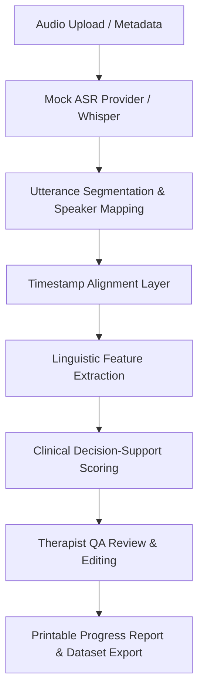

# Speech Therapist / Clinician Workflow Application (v1.1.0)

A modular, clinical decision-support prototype for extracting speech-language features from CHAT (`.cha`) transcripts and audio recordings to support ASD clinical assessment. Developed as part of a term paper project.

## Processing Pipeline Diagram



## System Purpose & Scope

This application provides speech-language pathologists (SLPs) and clinicians with a human-in-the-loop workflow to audit and edit speech-language transcription segments, view the Core 14-feature schema (with optional interaction/acoustic-derived indicators such as pause count, turn-taking, and response latency), track concern score trends longitudinally, and generate reports.

### Difference from TalkBankDB & Batchalign2
- **TalkBankDB & Batchalign2:** Primarily command-line or database-driven tools for batch processing CHILDES corpora, performing automated morphosyntactic tagging and part-of-speech parsing.
- **This Application:** Provides an interactive, therapist-facing web interface that wraps transcription, segmentation, and alignment. It allows SLPs to directly review, edit, and sign off on transcripts in a clinical dashboard, bridging the gap between automated pipelines and clinical decision-support.

## Clinical Safety Statement & Prototype Limitations

> [!IMPORTANT]
> **Clinical Safety Disclaimer:** This system is an AI-assisted language analysis prototype designed for progress tracking and clinical decision support only. **It does not diagnose ASD** and does not replace qualified clinical judgment. All outputs must be reviewed and signed off by a qualified therapist or clinician. Reports and AI outputs avoid diagnostic labels.

### Prototype Status & Limitations
- **Mock-Mode Workspace**: The therapist application defaults to `MOCK_MODE=true` and `DATA_MODE=mock`.
- **Auth Modes**: `AUTH_MODE=mock` keeps sample-account sign-in; `AUTH_MODE=provider_placeholder` fails closed until a real provider adapter is configured.
- **Persistence Modes**: `DATA_MODE=mock` uses seeded in-memory demo records, `DATA_MODE=localStorage` persists demo records in browser localStorage, and `DATA_MODE=database_placeholder` exposes the repository boundary without connecting to a real database.
- **File Storage Modes**: `FILE_STORAGE_MODE=metadata_only` stores only upload metadata, `FILE_STORAGE_MODE=browser_preview` creates a temporary browser object URL for local preview only, and `FILE_STORAGE_MODE=backend_placeholder` exposes the storage adapter boundary without sending file bytes to a server.
- **Audio Processing Modes**: `PROCESSING_MODE=mock` keeps the existing mock ASR workflow, `PROCESSING_MODE=api_placeholder` exposes the route contract without a backend, and `PROCESSING_MODE=backend` expects a configured backend API.
- **Metadata-Only Default**: Audio uploading defaults to metadata-only; no audio/video bytes are persisted unless a future backend storage adapter is explicitly implemented.
- **ASR & CHAT Generation**: Real automated speech recognition (ASR) and audio-to-CHAT pipeline execution must happen behind a backend API boundary; the browser app does not run Whisper or Python `audio_pipeline` directly.
- **Human Review Gate**: Backend-generated transcripts must be reviewed by a therapist or clinician before preliminary feature outputs or AI-assisted explanation are interpreted.
- **CHAT Review Workflow**: Session detail and transcript QA views can upload/select `.cha` transcripts. The parser preserves CHAT metadata lines, supported speaker tiers (`CHI`, `MOT`, `FAT`, `INV`, `CLI`, `PAR`), source line numbers, and optional timing markers for line-by-line review.
- **Feature Re-run Gate**: Editing speaker labels, utterance text, or interpretation notes marks extracted features as stale. The clinician-facing feature summary and AI-assisted explanation are refreshed only when the user selects **Re-run feature extraction**.
- **Clinical Review Flags**: Transcript markers such as `xxx`, `yyy`, `&=mumble`, `[/]`, possible echolalia-like repetition, possible pronoun reversal patterns, child questions, and zero spoken responses are shown as flags for clinician review, not as clinical conclusions.
- **Decision-Support AI Output**: All AI output is strictly designed for screening support (e.g., concern level, review priority, clinician review support) and must never be interpreted as an automated clinical conclusion.

### Clinical Validation Limitations
- This therapist workflow is not clinically validated.
- It has not been validated for Thai children.
- ASR-generated transcripts may contain errors for children's speech, noisy audio, overlapping speech, or multilingual speech.
- Mock/demo records and public corpora may not represent all clinical populations or care settings.
- Feature summaries and AI-assisted explanation require therapist review before interpretation.


## Modular Architecture

The application has been refactored from a monolithic codebase into a clean, modular ES module structure:
- **`src/models/`:** Standardized data models matching the Python backend (User, Case, Session, AudioFile, Transcript, Utterance, WordAlignment, LinguisticFeatureSet, TherapistReview, AIReport).
- **`src/store/`:** Centralized reactive state store and mock data seeds.
- **`src/providers/`:** Abstracted ASR engine interface with mock implementations.
- **`src/services/`:** Business logic services for segmentation, alignment, feature extraction, safety rules, and exporting.
- **`src/views/`:** View components handling rendering and user interaction bindings.
- **`src/components/`:** Reusable UI widgets including inline utterance editor, concern score gauge, and longitudinal trend/radar charts.

Database-ready table fields and RBAC ownership rules are documented in `../docs/THERAPIST_CLINICIAN_DATABASE_SCHEMA.md`.

## Run Locally

```bash
cd therapist-clinician-app
npm install
npm run dev
```

## Running Unit Tests

Unit tests verify segmentation, pronoun reversal, repeated words, turn taking, safety thresholds, and report generation.

To run tests in single-run mode (recommended for automated checks to prevent terminal hang):
```bash
npm run test
# or: npx vitest run
```

> [!NOTE]
> Running `npx vitest` without the `run` subcommand starts Vitest in **watch mode** by default. In watch mode, the process stays active to monitor file changes. If your test runner appears to hang, press `q` to exit, and ensure you use `npm run test` or append the `run` subcommand.


## Mock Accounts

| Role | Email | Password |
|---|---|---|
| therapist | `therapist@example.test` | `demo-password` |
| clinician | `clinician@example.test` | `demo-password` |
| admin | `admin@example.test` | `demo-password` |

## Future Work
- **Live Whisper API Integration:** Swap out `mock-asr-provider.js` with the real API engine.
- **CLAN Compatibility:** Extend the export-service to support full, strict TalkBank-compliant CHAT validation.
- **Database Persistence:** Connect the reactive store to a secure, HIPAA-compliant relational database.
