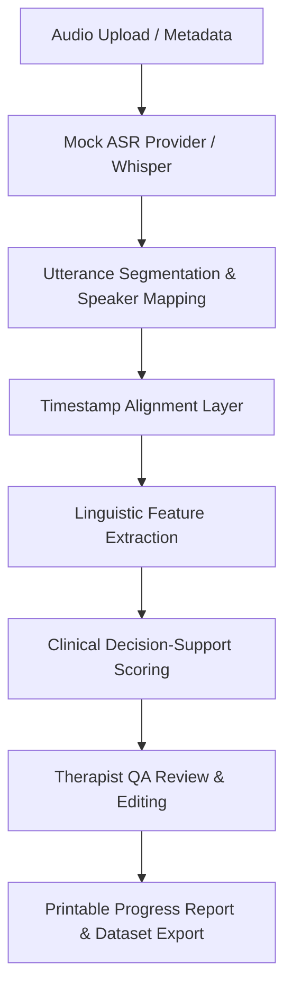

# Speech Therapist / Clinician Workflow Application (v1.0.0)

A modular, clinical decision-support prototype for extracting speech-language features from CHAT (`.cha`) transcripts and audio recordings to support ASD clinical assessment. Developed as part of a term paper project.

## Processing Pipeline Diagram



## System Purpose & Scope

This application provides speech-language pathologists (SLPs) and clinicians with a human-in-the-loop workflow to audit and edit speech-language transcription segments, view 18+ automated linguistic features, track concern score trends longitudinally, and generate reports.

### Difference from TalkBankDB & Batchalign2
- **TalkBankDB & Batchalign2:** Primarily command-line or database-driven tools for batch processing CHILDES corpora, performing automated morphosyntactic tagging and part-of-speech parsing.
- **This Application:** Provides an interactive, therapist-facing web interface that wraps transcription, segmentation, and alignment. It allows SLPs to directly review, edit, and sign off on transcripts in a clinical dashboard, bridging the gap between automated pipelines and clinical decision-support.

## Clinical Safety Statement

> [!IMPORTANT]
> **Clinical Safety Disclaimer:** This system is an AI-assisted language analysis prototype designed for progress tracking and clinical decision support only. **It does not diagnose ASD** and does not replace qualified clinical judgment. All outputs must be reviewed and signed off by a qualified therapist or clinician. Reports and AI outputs avoid diagnostic labels.

## Modular Architecture

The application has been refactored from a monolithic codebase into a clean, modular ES module structure:
- **`src/models/`:** Standardized data models matching the Python backend (User, Case, Session, AudioFile, Transcript, Utterance, WordAlignment, LinguisticFeatureSet, TherapistReview, AIReport).
- **`src/store/`:** Centralized reactive state store and mock data seeds.
- **`src/providers/`:** Abstracted ASR engine interface with mock implementations.
- **`src/services/`:** Business logic services for segmentation, alignment, feature extraction, safety rules, and exporting.
- **`src/views/`:** View components handling rendering and user interaction bindings.
- **`src/components/`:** Reusable UI widgets including inline utterance editor, concern score gauge, and longitudinal trend/radar charts.

## Run Locally

```bash
cd therapist-clinician-app
npm install
npm run dev
```

## Running Unit Tests

Unit tests verify segmentation, pronoun reversal, repeated words, turn taking, safety thresholds, and report generation:

```bash
# Run Vitest suite
npm run test
```

## Mock Accounts

| Role | Email | Password |
|---|---|---|
| therapist | `therapist@example.test` | `demo-password` |
| clinician | `clinician@example.test` | `demo-password` |
| admin | `admin@example.test` | `demo-password` |

## Future Work
- **Live Whisper API Integration:** Swap out `mock-asr-provider.js` with the real API engine.
- **CLAN Compatibility:** Extend the export-service to support full, strict TalkBank-compliant CHAT validation.
- **Database Persistence:** Connect the reactive store to a secure, HIPAA-compliant relational database.
